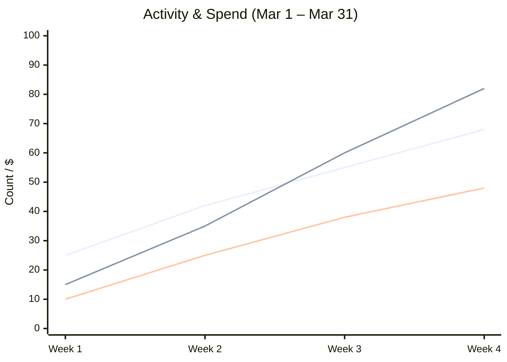

# Chapter 14: Enterprise Deployment and Governance

## Deploy via Anthropic Cloud, Bedrock, Vertex AI, or Microsoft Foundry

---

Adopting Claude Code is not just about developer productivity — it requires enterprise-grade governance. The following sections cover the five-step governance pipeline and the available deployment options.

### The Governance Pipeline

#### Step 1: Identity

**SSO** with Okta, Azure AD, or any SAML 2.0 provider. Engineers log into Claude Code with the same credentials they use for everything else. No separate accounts, no password sprawl.

**SCIM auto-provisioning** means when someone joins the engineering team in the identity provider, they automatically get Claude Code access. When they leave, access is revoked automatically. No manual account management.

#### Step 2: Permissions

**Managed policies** let IT centrally enforce what Claude can and cannot do. For example:
- Claude cannot execute shell commands on production servers
- Claude cannot access files outside the project directory
- Claude must use the approved MCP servers only

These policies are configured centrally and pushed to all users. Individual developers cannot override them.

#### Step 3: Implement (Spend Controls)

**Per-org and per-user spend caps** prevent runaway costs. Set a monthly budget at the organization level, and optionally per-team or per-user limits.

API-rate billing means you pay for what you use, with full visibility into who is using how much. No surprises at the end of the month.

#### Step 4: Validate (Observability)

**OpenTelemetry traces** give full visibility into what Claude Code is doing — which tools it called, which files it read, how long each operation took.

**Analytics API** provides aggregated usage data — number of sessions, tokens consumed, tasks completed, models used.

**Full audit logs** record every action for compliance. Who asked what, when, and what Claude did in response.

**Anthropic Console — Team Usage Dashboard:**

The Anthropic Console provides a centralized dashboard for tracking Claude Code adoption and spend across your organization.

<table style="background:#1a1a2e; color:#e0e0e0; border-radius:12px; padding:20px; width:100%; border:1px solid #333;">
<tr>
<td colspan="4" style="padding:10px 16px;">
<h3 style="color:#fff; margin:0;">Claude Code</h3>
</td>
<td colspan="2" style="text-align:right; padding:10px 16px; color:#aaa;">
📅 Mar 1 – Mar 31
</td>
</tr>

<!-- KPI Cards -->
<tr>
<td colspan="3" style="background:#252540; border-radius:8px; padding:16px; margin:8px;">

Lines of code accepted

42 K

</td>
<td colspan="3" style="background:#252540; border-radius:8px; padding:16px; margin:8px;">

Suggestion accept rate

96.8%

</td>
</tr>

<!-- Chart -->
<tr>
<td colspan="6" style="padding:16px 0;">

</td>
</tr>

<!-- Team Table Header -->
<tr>
<td colspan="4" style="padding:12px 16px;">
<b style="color:#fff; font-size:1.1em;">Team</b> 106
</td>
<td colspan="2" style="text-align:right; padding:12px 16px; color:#aaa;">
🔍 Search...
</td>
</tr>

<!-- Team Table -->
<tr style="border-bottom:1px solid #333;">
<td colspan="2" style="padding:8px 16px; color:#aaa;"><b>Members</b></td>
<td colspan="2" style="padding:8px 16px; color:#aaa; text-align:right;"><b>Avg daily spend</b></td>
<td colspan="2" style="padding:8px 16px; color:#aaa; text-align:right;"><b>Avg lines/day ↓</b></td>
</tr>
<tr style="border-bottom:1px solid #2a2a3e;">
<td colspan="2" style="padding:10px 16px; color:#fff;">Sarah Chen sarah@acme.com</td>
<td colspan="2" style="padding:10px 16px; color:#fff; text-align:right;">$42.21</td>
<td colspan="2" style="padding:10px 16px; color:#fff; text-align:right;">887</td>
</tr>
<tr style="border-bottom:1px solid #2a2a3e;">
<td colspan="2" style="padding:10px 16px; color:#fff;">Tommy Borges tborges@acme.com</td>
<td colspan="2" style="padding:10px 16px; color:#fff; text-align:right;">$36.35</td>
<td colspan="2" style="padding:10px 16px; color:#fff; text-align:right;">822</td>
</tr>
<tr style="border-bottom:1px solid #2a2a3e;">
<td colspan="2" style="padding:10px 16px; color:#fff;">Aisha Patel aisha@acme.com</td>
<td colspan="2" style="padding:10px 16px; color:#fff; text-align:right;">$33.55</td>
<td colspan="2" style="padding:10px 16px; color:#fff; text-align:right;">709</td>
</tr>
<tr style="border-bottom:1px solid #2a2a3e;">
<td colspan="2" style="padding:10px 16px; color:#fff;">Carlos Mendoza cmendoza@acme.com</td>
<td colspan="2" style="padding:10px 16px; color:#fff; text-align:right;">$26.09</td>
<td colspan="2" style="padding:10px 16px; color:#fff; text-align:right;">640</td>
</tr>
<tr style="border-bottom:1px solid #2a2a3e;">
<td colspan="2" style="padding:10px 16px; color:#fff;">Casey Murphy casey@acme.com</td>
<td colspan="2" style="padding:10px 16px; color:#fff; text-align:right;">$24.25</td>
<td colspan="2" style="padding:10px 16px; color:#fff; text-align:right;">389</td>
</tr>
<tr style="border-bottom:1px solid #2a2a3e;">
<td colspan="2" style="padding:10px 16px; color:#fff;">Ngozi Okafor ngozi@acme.com</td>
<td colspan="2" style="padding:10px 16px; color:#fff; text-align:right;">$18.61</td>
<td colspan="2" style="padding:10px 16px; color:#fff; text-align:right;">243</td>
</tr>
<tr>
<td colspan="2" style="padding:10px 16px; color:#fff;">Dmitri Petrov dpetrov@acme.com</td>
<td colspan="2" style="padding:10px 16px; color:#fff; text-align:right;">$10.01</td>
<td colspan="2" style="padding:10px 16px; color:#fff; text-align:right;">212</td>
</tr>
</table>

**What this dashboard tells leadership:**
- **Lines of code accepted (42K)** — direct measure of Claude Code output absorbed into the codebase
- **Suggestion accept rate (96.8%)** — quality signal; high rate means Claude's suggestions are relevant
- **Activity trend** — user adoption and session growth over time
- **Spend trend** — cost trajectory correlated with usage growth
- **Per-member breakdown** — identify power users, spot underutilization, and optimize seat allocation

> This is the Anthropic Console view available on Team and Enterprise plans. It answers the leadership question: *"What are we getting for our Claude Code investment?"*

#### Step 5: Commit (Security)

**No training on your data.** This is Anthropic's commitment — code sent to Claude is used only for inference, never for model training.

**TLS 1.3** encryption in transit. **AES-256** encryption at rest. **VPC isolation** for enterprise deployments.

### Deployment Options

There are four choices, depending on infrastructure and compliance requirements:

| Option                     | Best For                                                   |
| -------------------------- | ---------------------------------------------------------- |
| **Anthropic Cloud (SaaS)** | Fastest setup, fully managed, ideal for teams starting out |
| **AWS Bedrock**            | VPC isolation, IAM integration, AWS-native organizations   |
| **Google Vertex AI**       | GCP-native, data residency requirements in GCP regions     |
| **Microsoft Foundry**      | Azure-native, enterprise policies, Microsoft ecosystem     |

For organizations with strict data residency requirements, Bedrock, Vertex, and Foundry keep data within the cloud provider's infrastructure. The Claude models run inside the VPC — no data leaves the environment.

### Enterprise Best Practices

**Pin model versions** on Bedrock, Vertex, or Foundry. When a new model version is released, test it in staging before rolling it to production. This prevents unexpected behavior changes from affecting the team.

**Use LLM gateways** for centralized routing. Tools like LiteLLM or a custom gateway can route Claude Code requests through a single point, enabling centralized logging, rate limiting, and failover.

**Configure managed settings via plist (macOS) or Registry (Windows).** IT can push Claude Code configuration to all machines through MDM, ensuring consistent settings across the organization.

**Check `.mcp.json` into repos.** Every repository should have its MCP configuration committed so that team integrations are consistent and version-controlled.

**Route through corporate proxy** using the `HTTPS_PROXY` environment variable. Claude Code respects proxy settings, ensuring all traffic goes through the network security infrastructure.

### Security Commitments

| Certification     | Status                               |
| ----------------- | ------------------------------------ |
| SOC 2 Type II     | Certified                            |
| No data training  | Contractual commitment               |
| TLS 1.3 + AES-256 | All data in transit and at rest      |
| VPC isolation     | Available via Bedrock/Vertex/Foundry |

---

## Key Message for Leadership

Claude Code meets enterprise security and governance requirements out of the box. SSO, audit logs, spend controls, data residency, and zero training on your data. The question is not "is it secure enough?" — it is "how fast can we deploy it?"

---

## Useful Links

- [Claude Code for Team and Enterprise](https://www.anthropic.com/news/claude-code-on-team-and-enterprise)
- [Anthropic Plans and Pricing](https://claude.com/pricing)
- [Claude on AWS Bedrock](https://docs.aws.amazon.com/bedrock/latest/userguide/model-parameters-claude.html)
- [Claude on Google Vertex AI](https://platform.claude.com/docs/en/api/claude-on-vertex-ai)
- [Google Cloud Model Garden — Claude](https://cloud.google.com/products/model-garden/claude)
- [Claude Code Security](https://code.claude.com/docs/en/security)
- [Claude Code Sandboxing](https://www.anthropic.com/engineering/claude-code-sandboxing)
- [Anthropic API Getting Started](https://platform.claude.com/docs/en/api/getting-started)
